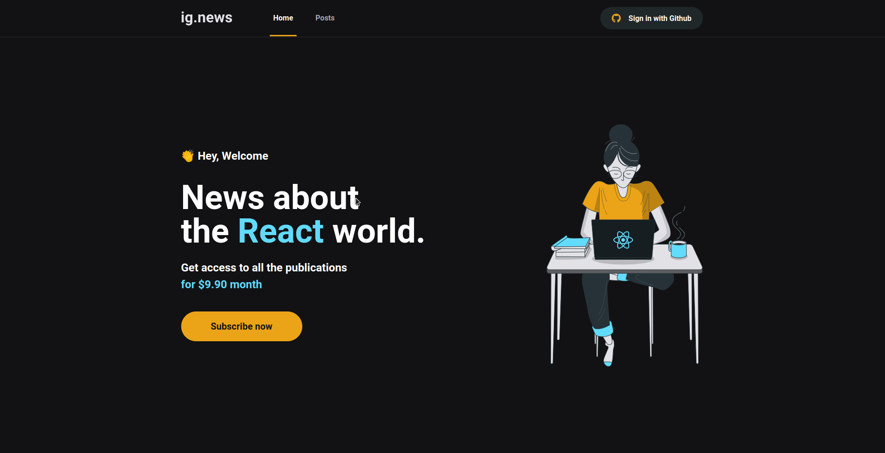

<p align="center">
    
</p>

##

<h4 align="center"> 
	🚧 IgNews 1.0 🚧
</h4>

<p align="center">
     
    
</p>
    
## 💻 Sobre o projeto 

💡 IgNews - Consiste na ideia de um blog voltado a tecnologia, com foco em atualizações, novas funcionalidades e curiosidades sobre React. 
Onde com uma sessão comum é possível apenas ter um preview dos posts. Para ter acesso ao conteúdo completo é necessário login e o pagamento de uma taxa
de R$ 9,90 por mês. Desenvolvido com base na trilha Ignite React.js - RocketSeat.


## 💻 Interface Web
<p align="center">
    
</p>

## 🛠 Tecnologias

As seguintes ferramentas foram usadas na construção do projeto:

- Next.js
- TypeScript
- FaunaDB
- Prismic CMS
- SASS
- Next-Auth
- Stripe

## Pré-requisitos

Antes de começar, é preciso ter instalado em sua máquina as seguintes ferramentas:

- Git
- Yarn
- Stripe CLI

## 🚀 Como executar o projeto

```bash
# Clone este repositório
$ git clone https://github.com/alexandrerehder/ignews

# Execute stripe listen para ouvir eventos do webhook
$ stripe listen --forward-to localhost:3000/api/webhooks 

# Acesse a pasta do projeto, instale as dependências e inicie a aplicação
$ cd ignews && yarn && yarn dev

# A aplicação web inciará na porta:3000 - acesse http://localhost:3000
```
